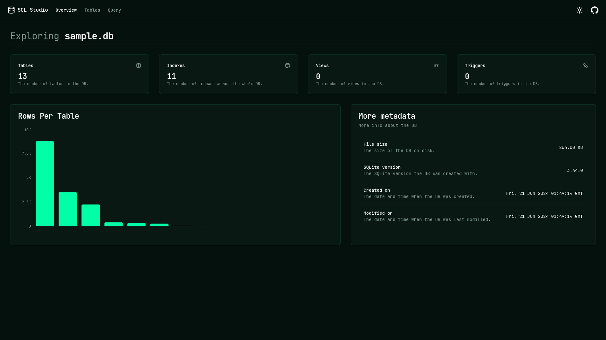
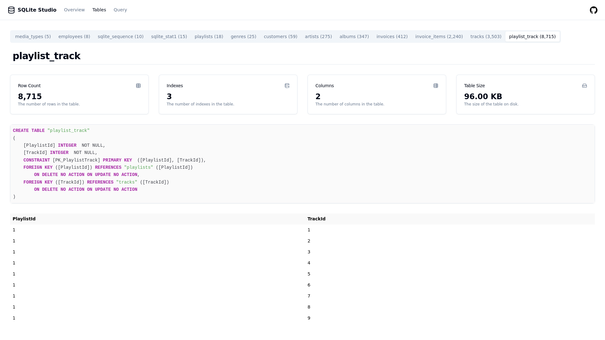
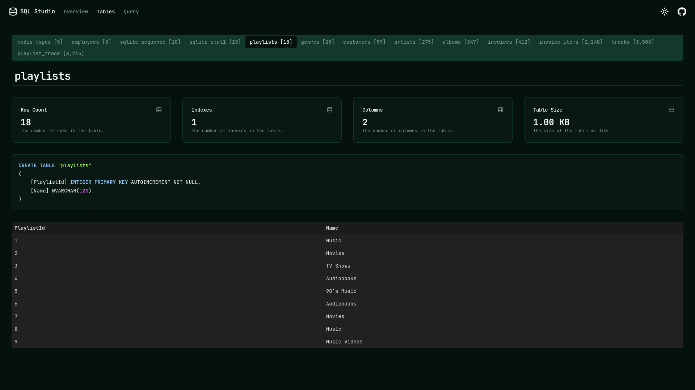
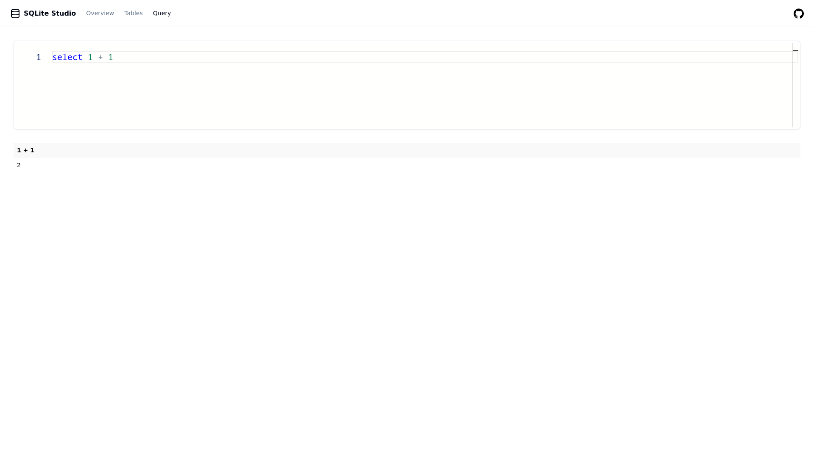
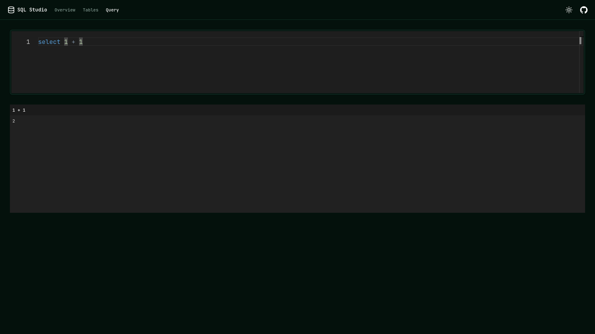

# SQL Studio

Single binary, single command SQL database explorer. SQL studio supports *SQLite*, *libSQL*, *PostgreSQL*, *MySQL* and *DuckDB*.

### Local SQLite DB File

```bash
sql-studio sqlite [sqlite_db]
```

### Remote libSQL Server

```bash
sql-studio libsql [url] [auth_token]
```

### PostgreSQL Server

```bash
sql-studio postgres [url]
```

### MySQL/MariaDB Server

```bash
sql-studio mysql [url]
```

### Local DuckDB File

```bash
sql-studio duckdb [duckdb_file]
```

### ClickHouse Server (Partial Support)

```bash
sql-studio clickhouse [URL] [USER] [PASSWORD] [DATABASE]
```

## Features

- Overview page with common metadata.
- Tables page with each table's metadata.
- Queries page with more access to your db.
- Infinite scroll rows view.

More features available on the [releases page](https://github.com/frectonz/sql-studio/releases).

## Screenshots

### Overview Page




### Tables Page




### Query Page




## Installation

### Install prebuilt binaries via shell script (MacOS and Linux)

```bash
curl --proto '=https' --tlsv1.2 -LsSf https://github.com/frectonz/sql-studio/releases/download/0.1.27/sql-studio-installer.sh | sh
```

### Install prebuilt binaries via powershell script

```powershell
powershell -c "irm https://github.com/frectonz/sql-studio/releases/download/0.1.26/sql-studio-installer.ps1 | iex"
```

### Updating

```bash
sql-studio-update
```

## Nix

```bash
nix shell github:frectonz/sql-studio
```

## Contributing

Before executing `cargo run` you need to build the UI because the rust app statically embedded the UI files in the binary.

```bash
git clone git@github.com:frectonz/sql-studio.git
cd sql-studio
nix develop # if you use nix
cd ui
npm install
npm run build
cd ..
cargo run
```
