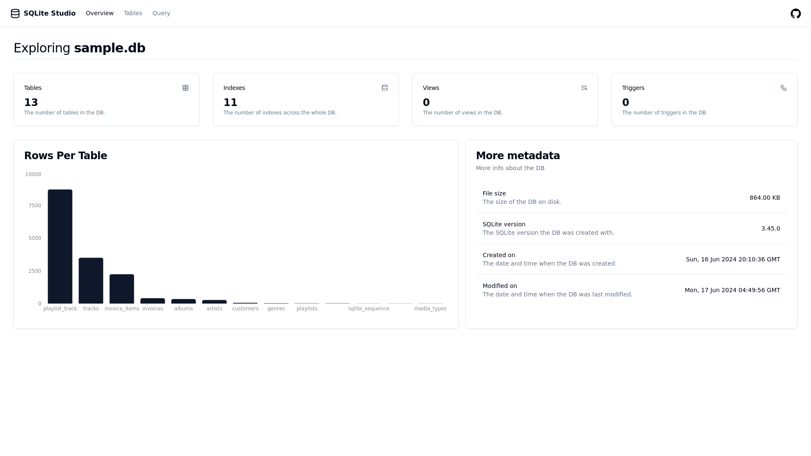

# SQLite Studio

Single binary, single command SQLite database explorer. SQLite studio supports opening both *local SQLite DB files* and *libSQL servers*.

### Local SQLite DB File

```bash
sqlite-studio sqlite [sqlite_db]
```

### Remote libSQL Server

```bash
sqlite-studio libsql [url] [auth_token]
```

## Features

- Overview page with common metadata.
- Tables page with each table's metadata, including the disk size being used by each table.
- Infinite scroll rows view.
- A custom query page that gives you more access to your db.

More features available on the [releases page](https://github.com/frectonz/sqlite-studio/releases).

## Screenshots

### Home Page



### Tables Page


### Query Page


## How To Run It

### Pre-Built Binaries

You can find pre-built binaries for the following targets on the [releases](https://github.com/frectonz/sqlite-studio/releases) page.

- Linux `sqlite-studio_<release>_x86_64-unknown-linux-musl.zip`
- Windows `sqlite-studio_<release>_x86_64-pc-windows-gnu.zip`
- MacOS x86 `sqlite-studio_<release>_x86_64-apple-darwin.zip`

After downloading the ZIP archive, you can extract it and get the binary.

### Nix

If you are using [Nix](https://nixos.org/), to build it from source.

```bash
nix shell github:frectonz/sqlite-studio
sqlite-studio [sqlite_db]
```

## Contributing

Before executing `cargo run` you need to build the UI because the rust app statically embedded the UI files in the binary.

```bash
git clone git@github.com:frectonz/sqlite-studio.git
cd sqlite-studio
nix develop # if you use nix
cd ui
npm install
npm run build
cd ..
cargo run <sqlite_db>
```
